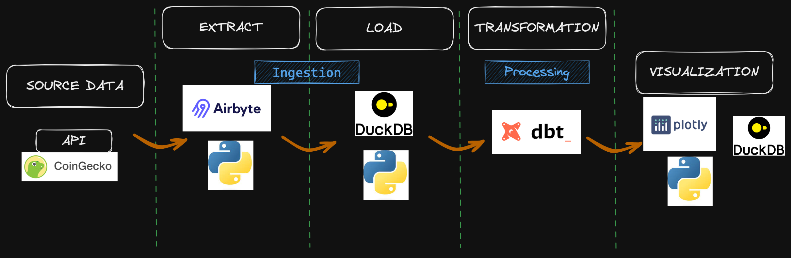

# ELT Crypto

The project is composed of series in 3 parts :
- Ingestion 
- Transformation (TODO)
- Visualization 

### Architecture

### Setup

The project requires :
* Python 3.9
* Poetry for dependency management.

Finally, a `Makefile` is available to run common tasks.

## Ingestion

### Run :
You can then run the following commands :
* `make install`: to install dependencies
* `make py-ingest` : to run the ingestion pipeline

## Transformation (Todo)
* dbt dependencies with dbt-duckdb

## Visualization

This part supposes that you have done the setup from the Ingestion part above.
### Run :
You can then run the following command :
* `make py-viz` : to run the ingestion pipeline

### Next steps - TODOs

1 - Resolve dependencies issues with `poetry` between `dbt` and `airbyte` 

2 - Find a way to connect dbt with Duckdb database in order to run the dbt models

4 - Enhance incremental ingestion and transformation

3 - Enable the Airflow DAG with the ELT
* Let the liberty of choosing the coin, the number of day and the date to get the data.

